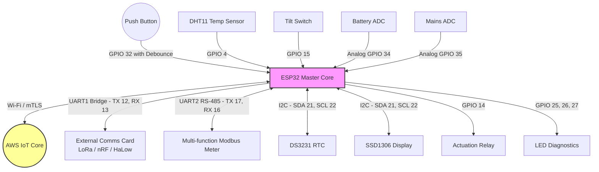
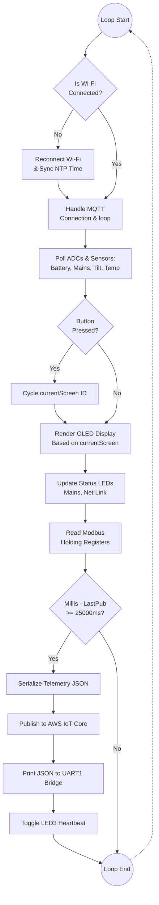
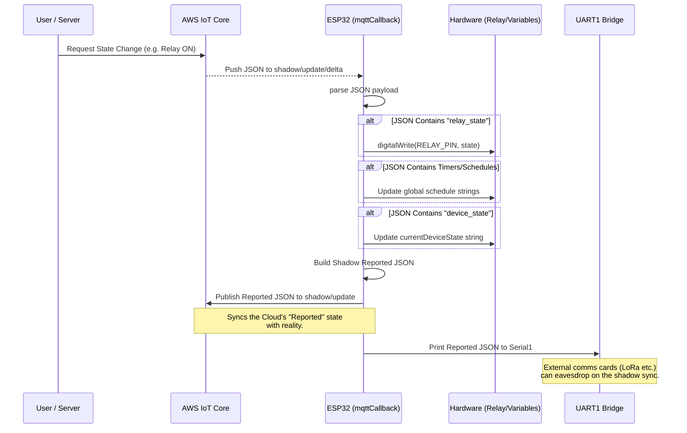

# CCMS V2.0 Firmware - Mermaid Flow Diagrams

This file contains Mermaid.js diagrams illustrating the hardware architecture, main software execution loop, and the AWS Device Shadow data flow of the CCMS ESP32 V2.0 System.

You can view these diagrams natively in VS Code by installing a Markdown preview extension that supports Mermaid (like "Markdown Preview Mermaid Support"), or by pasting the code blocks into the [Mermaid Live Editor](https://mermaid.live).

## 1. System Hardware Architecture

This diagram outlines the physical hardware topology, illustrating what is connected to the ESP32 and via which interfaces.

---

## 2. Main Software Execution Loop

This flowchart visualizes the non-blocking execution thread running inside the `loop()` function of `main.cpp`.

---

## 3. Remote Control & AWS Shadow Delta Flow

This sequence diagram shows how remote control commands flow from the Cloud (AWS) down down to the end-node components.

