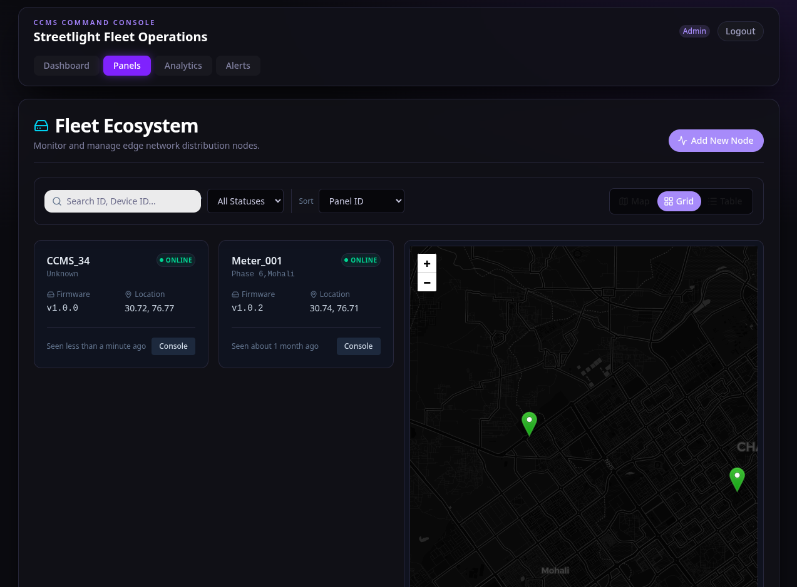
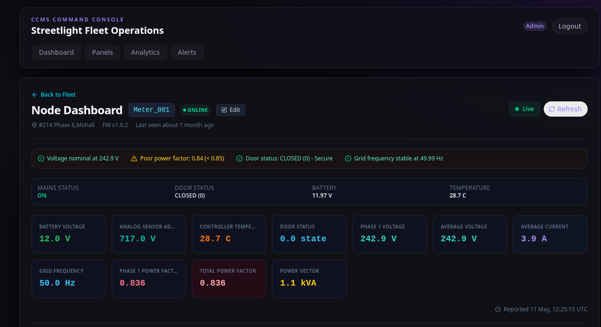
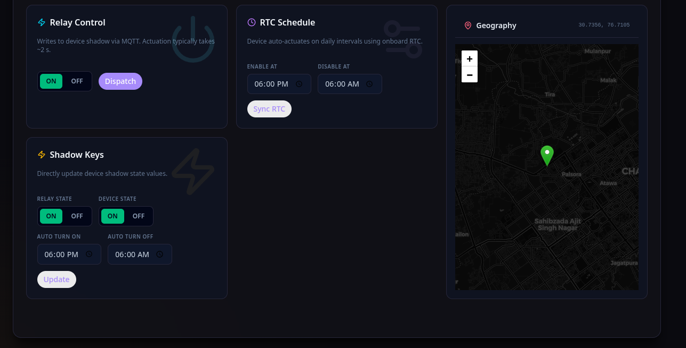
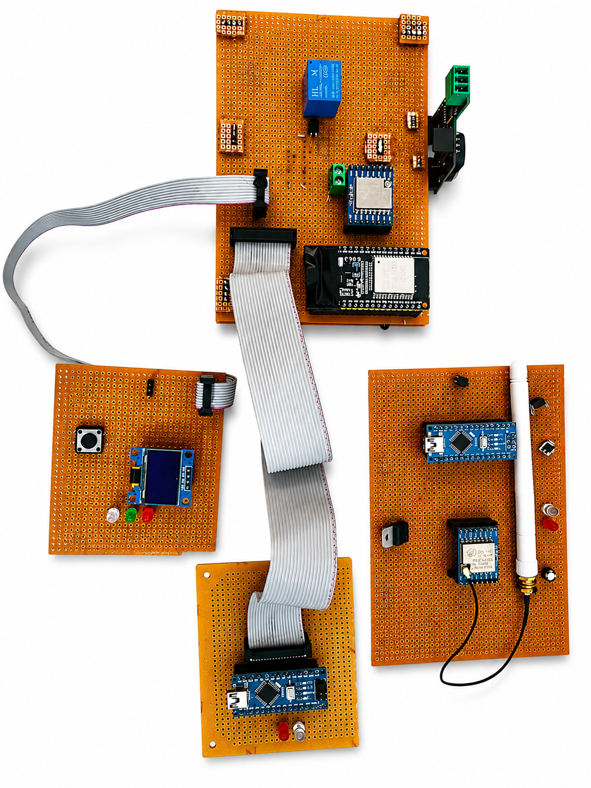

# CCMS Portal — Centralized Command & Monitoring System

A full-stack smart streetlight fleet management system with real-time monitoring, remote control, and analytics. This monorepo contains the Next.js operator console, AWS Lambda backend, ESP32 firmware for the edge devices, and PCB designs.

## Screenshots & Assets

| Fleet Info | Node Info | Command Menu |
|:---:|:---:|:---:|
|  |  |  |

| Prototype | Power Supply Unit | Offsite Interface Card |
|:---:|:---:|:---:|
|  |  |  |

---

## Architecture Overview

```text
┌──────────────────┐       ┌──────────────┐       ┌─────────────────┐
│ RPi Gateway + STM│──────▶│   AWS IoT    │──────▶│  SQS → Lambda   │──────▶ DynamoDB
│  (streetlights)  │  MQTT │   Core       │       │ (saveDataFromSQ)│
└──────────────────┘       └──────────────┘       └─────────────────┘
                                                          │
                                                          ▼
┌──────────────────┐       ┌──────────────┐       ┌─────────────────┐
│   Next.js App    │◀──────│   Lambda     │◀──────│  DynamoDB       │
│  (operator       │  REST │   API        │       │                 │
│   console)       │       │   Gateway    │       │                 │
└──────────────────┘       └──────────────┘       └─────────────────┘
```

### Components

| Layer                             | Technology                            | Location                                                         |
| --------------------------------- | ------------------------------------- | ---------------------------------------------------------------- |
| **Web Portal**                    | Next.js 16, React 19, Tailwind CSS v4 | [`Frontend/ccms/`](./Frontend/ccms)                              |
| **Backend API**                   | Python AWS Lambda                     | [`Backend/Lambda/`](./Backend/Lambda)                            |
| **Firmware (RPi Gateway)**        | Python 3                              | [`Firmware/RPi_Gateway/`](./Firmware/RPi_Gateway)                |
| **Firmware (STM32 Node)**         | C++ (PlatformIO), STM32               | [`Firmware/STM32_Peripheral/`](./Firmware/STM32_Peripheral)      |
| **Firmware v2.0**                 | C++ (PlatformIO), ESP32               | [`Firmware/ESP32_wifi_CCMS_v2.0/`](./Firmware/ESP32_wifi_CCMS_v2.0) |
| **Firmware v2.0 (Pi link)**       | C++ (PlatformIO), ESP32               | [`Firmware/ESP32_wifi_CCMS_v2.0_PI_link/`](./Firmware/ESP32_wifi_CCMS_v2.0_PI_link) |
| **Firmware v1.0**                 | C++ (PlatformIO), ESP32               | [`Firmware/ESP32_wifi_CCMS_v1.0/`](./Firmware/ESP32_wifi_CCMS_v1.0) |
| **Hardware**                      | PCB Designs                           | [`Hardware/PCB Designs/`](./Hardware/PCB%20Designs)              |
| **Documentation**                 | MkDocs (Material theme)               | [`docs/`](./docs), [`mkdocs.yml`](./mkdocs.yml)                  |

---

## Frontend — Operator Console (`Frontend/ccms/`)

A Next.js static export application that provides a real-time operations dashboard for managing streetlight fleets.

### Pages

| Route                   | Description                                                                    |
| ----------------------- | ------------------------------------------------------------------------------ |
| `/`                   | Landing page with login / dashboard links                                      |
| `/login`              | Authenticate using Dashboard Key and Admin Key                                 |
| `/dashboard`          | Fleet-wide summary (panel count, active alarms, grid metrics, energy estimate) |
| `/panels`             | Browse, filter, and search all panels (map + list views)                       |
| `/panel?id={panelId}` | Live status, telemetry charts, command dispatch (relay, schedule, shadow keys) |
| `/manage-panel`       | Register new panels with GPS coordinates                                       |
| `/analytics`          | Historical telemetry viewer with date range filtering                          |
| `/alerts`             | Active alerts list with severity filtering and acknowledgment                  |

### Key Technologies

- **Framework**: Next.js 16 (`output: "export"` — fully static, no server functions)
- **UI Library**: HeroUI v3, Lucide icons
- **Charts**: Recharts (telemetry time-series)
- **Maps**: Leaflet + React-Leaflet (panel fleet locations, location picker)
- **Styling**: Tailwind CSS v4, Framer Motion (animations)
- **Auth**: API keys stored in `localStorage`, sent as `x-dashboard-key` / `x-admin-key` headers

### Environment Variables

```env
NEXT_PUBLIC_API_BASE_URL=<Lambda API Gateway endpoint>
```

Copy `Frontend/ccms/.env.example` → `Frontend/ccms/.env.local` and fill in real values.

### Run Locally

```bash
cd Frontend/ccms
npm install
npm run dev       # development server at http://localhost:3000
npm run build     # static export to Frontend/ccms/out/
```

---

## Backend — AWS Lambda (`Backend/Lambda/`)

Python-based serverless functions deployed behind API Gateway.

### Functions

| File                                                         | Purpose                                                                            |
| ------------------------------------------------------------ | ---------------------------------------------------------------------------------- |
| [`lambdaAPI.py`](./Backend/Lambda/lambdaAPI.py)                       | REST API handler — serves dashboard snapshot, panel status, history, and commands |
| [`saveDataFromSQStoDB,py`](./Backend/Lambda/saveDataFromSQStoDB,py) | SQS-triggered function that writes incoming telemetry to DynamoDB                  |

### API Endpoints (via `DashboardAPIHandler`)

| Method    | Query / Body                                             | Description                                      |
| --------- | -------------------------------------------------------- | ------------------------------------------------ |
| `GET`   | `?enquiry=snapshot`                                    | Returns all panels with latest data and metadata |
| `GET`   | `?enquiry=history&panel_id=X&start=T&end=T`            | Historical telemetry for a panel                 |
| `POST`  | `{ panel_id, ... }`                                    | Register a new panel                             |
| `PATCH` | `{ panel_id, desired_state/schedule/shadowKeys, ... }` | Send commands to a panel                         |

### Test Endpoints

A Node.js test script is available at [`Backend/Lambda/TestEndpoints/getData.js`](./Backend/Lambda/TestEndpoints/getData.js) for manual API testing.

---

## Hardware — Edge Firmware

The project supports both ESP32-centric designs and a new hybrid Raspberry Pi + STM32 architecture.

| Variant                | Description                                                                 |
| ---------------------- | --------------------------------------------------------------------------- |
| **RPi Gateway**        | Python daemon acting as an IoT gateway, handling AWS IoT MQTT and Shadow.   |
| **STM32 Peripheral**   | Hard-realtime STM32 node for sensors and Modbus, reports to RPi Gateway.    |
| **v1.0 (ESP32)**       | Base implementation with WiFi, MQTT, and energy meter reading               |
| **v2.0 (ESP32)**       | Enhanced version with AWS IoT Core integration, relay control, OTA-ready    |
| **v2.0 PI Link (ESP32)** | Variant designed to communicate via Raspberry Pi for additional relay logic |

### Key Hardware Interfaces (RPi + STM32)

- **Raspberry Pi**: Network handling (WiFi/Ethernet), AWS IoT Core communication.
- **Serial (UART)**: Two-way communication between Pi and STM32 (Baud 115200).
- **Relay Control**: Managed by STM32 GPIO (`PA0`).
- **Modbus**: Read by STM32 via RS485 transceiver.

Build STM32 firmware with [PlatformIO](https://platformio.org/):

```bash
cd Firmware/STM32_Peripheral
pio run -t upload
```

---

## API Types

All frontend types are defined in [`Frontend/ccms/lib/api/types.ts`](./Frontend/ccms/lib/api/types.ts). Key models:

- **PanelRecord** — panel metadata, status, GPS coordinates
- **PanelLiveStatus** — real-time telemetry snapshot (voltage, current, power factor, frequency, battery, temperature, tilt)
- **TelemetryPoint** — historical data point matching live status fields
- **PanelCommandPayload** — `SET_MANUAL_STATE`, `UPDATE_RTC_SCHEDULE`, or `UPDATE_SHADOW_KEYS`
- **AlertRecord** — fault alerts with severity, status, acknowledgment tracking
- **DashboardSummary** — fleet-wide aggregate metrics

---

## Documentation

Full project documentation is built with [MkDocs](https://www.mkdocs.org/) using the Material theme.

```bash
pip install mkdocs-material
mkdocs serve       # local preview at http://127.0.0.1:8000
mkdocs gh-deploy   # publish to GitHub Pages
```

The documentation is auto-deployed via [GitHub Actions](https://github.com/settings/actions) on pushes to `main` that touch `docs/` or `mkdocs.yml`.

### Included Docs

- [Frontend & Lambda Report](./docs/frontend-lambda-project-report.md)
- [Web Portal Guide](./docs/web-portal.md)
- [Hardware (ESP32)](./docs/hardware.md)
- [Lambda Backend](./docs/lambda.md)

---

## CI / CD

| Workflow                                        | Trigger                         | Action                                    |
| ----------------------------------------------- | ------------------------------- | ----------------------------------------- |
| [`gh-pages.yml`](.github/workflows/gh-pages.yml) | Push to `main` (docs changes) | Builds and deploys MkDocs to GitHub Pages |

---

## Project Structure

```text
CCMS_PORTAL/
├── Frontend/
│   └── ccms/                          ← Next.js operator console
├── Backend/
│   └── Lambda/                        ← AWS Lambda backend
├── Firmware/
│   ├── RPi_Gateway/                   ← Raspberry Pi Python daemon
│   ├── STM32_Peripheral/              ← STM32 hardware controller
│   ├── ESP32_wifi_CCMS_v1.0/          ← Firmware v1.0
│   ├── ESP32_wifi_CCMS_v2.0/          ← Firmware v2.0
│   └── ESP32_wifi_CCMS_v2.0_PI_link/  ← Firmware v2.0 (Pi link variant)
├── Hardware/
│   └── PCB Designs/                   ← Hardware designs
├── docs/                          ← MkDocs documentation source
├── mkdocs.yml                     ← Documentation site configuration
└── .github/workflows/             ← CI/CD pipelines
```
